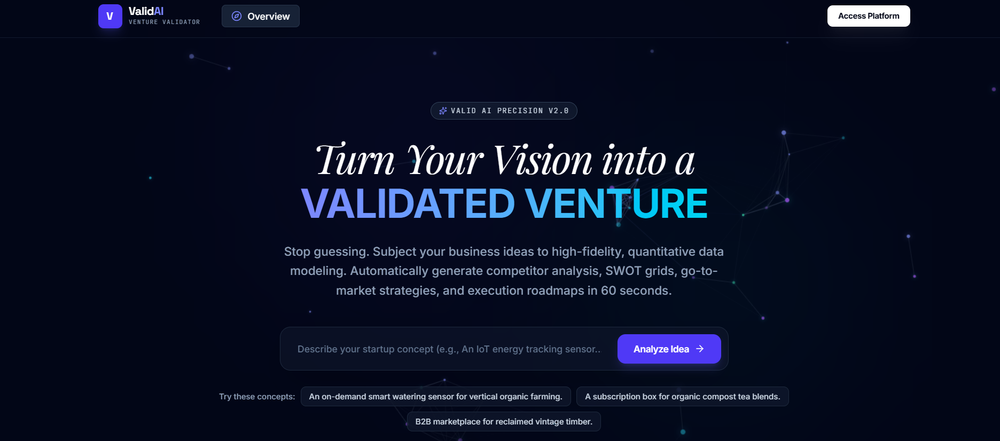
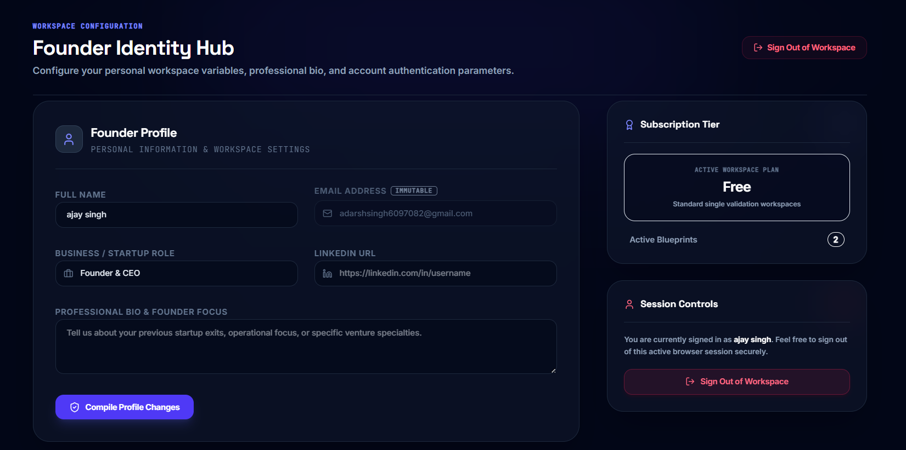
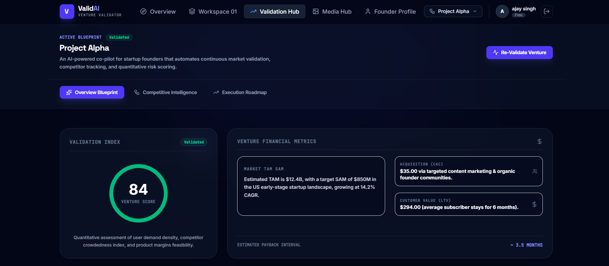
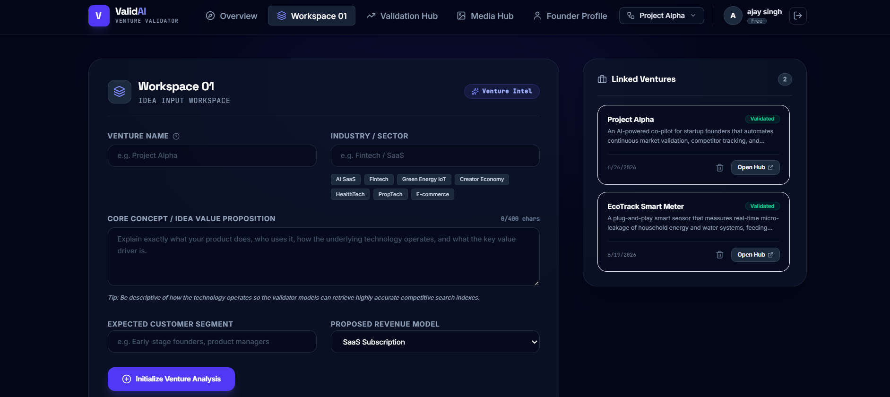

<div align="center">

# 🚀 Valid AI

### AI-Powered Startup Validation Platform

Validate startup ideas with AI-driven market research, competitor analysis, strategic insights, and personalized business roadmaps.


</div>

---

## 📖 Overview

**Valid AI** is an AI-assisted full-stack web application that helps entrepreneurs evaluate and refine startup ideas before investing time and resources.

The platform generates intelligent insights by analyzing business concepts, market opportunities, competition, risks, and growth strategies using Google's Gemini AI.

> **Note:** This project was created using AI-assisted development. AI was used extensively for code generation and implementation, while the overall project planning, feature selection, testing, debugging, customization, and integration were directed by me.

---

## ✨ Features

- 💡 Startup Idea Validation
- 📊 Market Analysis
- 🏆 Competitor Research
- ⚠️ Risk Assessment
- 📈 Strategic Intelligence
- 🛣️ Personalized Growth Roadmap
- 👤 Founder Profile Management
- 🖼️ Media Gallery
- 🔐 Authentication
- 🤖 Gemini AI Integration
- ⚡ Responsive Modern UI

---

## 🛠️ Tech Stack

### Frontend

- React
- TypeScript
- Vite
- CSS

### Backend

- Node.js
- Express.js

### AI

- Google Gemini API

---

## 📂 Project Structure

```
valid-ai/
│
├── src/
│   ├── components/
│   ├── App.tsx
│   └── main.tsx
│
├── server/
│   ├── db.ts
│   └── gemini.ts
│
├── assets/
├── package.json
└── README.md
```

---

## 🚀 Getting Started

### Clone the repository

```bash
git clone https://github.com/yourusername/valid-ai.git
```

### Navigate to project

```bash
cd valid-ai
```

### Install dependencies

```bash
npm install
```

### Configure environment variables

Create a `.env` file using `.env.example`.

Example:

```env
GEMINI_API_KEY=your_api_key_here
```

### Run the project

```bash
npm run dev
```

---

## 🎯 Purpose

This project demonstrates how modern AI-assisted development can accelerate the creation of full-stack web applications while maintaining developer oversight for architecture, customization, testing, and integration.

---

## 🤖 AI-Assisted Development

This project was built using AI-assisted coding tools.

AI was used to help with:

- Code generation
- Component creation
- API integration
- Debugging
- Refactoring
- Documentation

My responsibilities included:

- Project planning
- Feature selection
- Prompt engineering
- Architecture decisions
- Integration
- Testing
- UI customization
- Error fixing
- Final deployment preparation

---

## 📸 Screenshots

<p align="center">
  
  
  
  
  
</p>

---

## 🔮 Future Improvements

- Payment Integration
- Multi-language Support
- Team Collaboration
- Export Reports as PDF
- AI Chat Assistant
- Investor Pitch Generator
- Analytics Dashboard

---

## 👨‍💻 Author

**Ajay**

If you found this project interesting, feel free to ⭐ the repository.

---

<div align="center">

Made with using AI-assisted development.

</div>
